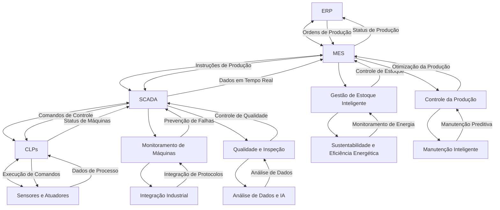

Integrantes do Grupo:

Gabriel Eliezer

Bruno Sakamoto

Henrique Fernandez

Rafael Rodrigues

# Redes Industriais🔗🌐

   #### 🌐Redes industriais são sistemas de comunicação projetados para conectar e gerenciar dispositivos, sensores, atuadores e controladores em ambientes de automação industrial. Elas permitem a troca de dados e controle em tempo real entre equipamentos de diferentes fabricantes, garantindo a operação eficiente de processos industriais. As redes industriais são essenciais em setores como manufatura, energia, transporte e petroquímico, pois oferecem maior confiabilidade, segurança e desempenho, além de permitir a integração de sistemas como SCADA (Supervisory Control and Data Acquisition) e PLCs (Programmable Logic Controllers). Exemplos comuns de protocolos de comunicação em redes industriais incluem Modbus, Profibus, Ethernet/IP e PROFINET.🌐

# Índice
1. [Introdução](#introdução)
2. [Redes Industriais](#redes-industriais)
3. [Aplicação e Requisitos](#redes-industriais-aplicação-e-requisitos)
4. [Desafios nas Redes Industriais](#desafios-nas-redes-industriais)
5. [Protocolos e Adequação](#protocolos-disponíveis-e-sua-adequação-para-diferentes-aplicações-industriais)
6. [Segurança](#medidas-para-melhorar-a-segurança-das-redes-industriais)
7. [Escolha do Protocolo](#escolha-do-protocolo-considerações-para-o-setor)
8. [Benefícios](#benefícios-esperados-de-uma-rede-industrial-bem-planejada)

# Redes Industriais

As redes industriais são essenciais para a comunicação entre dispositivos em ambientes de automação, oferecendo alta confiabilidade, segurança e desempenho. Abaixo estão algumas das redes industriais mais comuns:

## 1. **Ethernet/IP (Ethernet Industrial Protocol)**
- Utiliza a infraestrutura Ethernet padrão para comunicação em tempo real.
- Permite a integração de dispositivos e sistemas industriais em uma rede de alto desempenho.

## 2. **PROFINET**
- Baseado em Ethernet, é amplamente utilizado na automação industrial para comunicação entre dispositivos como PLCs, sensores e atuadores.
- Oferece baixa latência e alta confiabilidade.

## 3. **Modbus**
- Um dos protocolos mais antigos e amplamente utilizados em redes industriais.
- Pode ser implementado em diferentes camadas de comunicação, como Modbus RTU (para comunicação serial) e Modbus TCP (para Ethernet).

## 4. **Profibus (Process Field Bus)**
- Usado para a comunicação entre dispositivos em automação de processos e controle de fábrica.
- Comum em ambientes de manufatura e indústrias de automação.

## 5. **DeviceNet**
- Baseado em CAN (Controller Area Network), é utilizado para a interconexão de dispositivos industriais, como sensores, atuadores e dispositivos de controle.

## 6. **CC-Link (Control and Communication Link)**
- Uma rede de comunicação de alto desempenho muito utilizada na automação industrial, especialmente no Japão e na Ásia.

## 7. **AS-Interface (AS-i)**
- Um protocolo simples e econômico para comunicação entre sensores e atuadores em ambientes de automação.

Essas redes industriais desempenham um papel crucial na integração e no controle de processos industriais, garantindo eficiência e comunicação em tempo real.

# Redes Industriais: Aplicação e Requisitos

Nem todas as redes podem ser usadas de forma industrial, pois as **redes industriais** possuem requisitos específicos em termos de desempenho, confiabilidade, robustez e tempo real, que nem todos os protocolos de rede padrão atendem adequadamente. Para que uma rede seja considerada "industrial", ela deve ser projetada para operar em ambientes exigentes, como fábricas, usinas e outras instalações de automação, onde as condições são mais rigorosas.

## Fatores que uma Rede Industrial deve Atender:

### 1. **Desempenho em Tempo Real**
   - Redes industriais exigem comunicação de baixa latência e garantias de tempo de resposta. Isso é fundamental para o controle em tempo real de máquinas, sensores e atuadores.
   - Protocolos como **PROFINET** e **Ethernet/IP** são projetados para garantir esse desempenho.

### 2. **Robustez e Resistência a Interferências**
   - Ambientes industriais muitas vezes têm condições adversas, como ruídos eletromagnéticos e vibrações. Redes industriais são projetadas para suportar essas condições.
   - Redes como **Modbus**, **Profibus**, e **DeviceNet** são robustas e conseguem operar em ambientes de alta interferência.

### 3. **Alta Disponibilidade e Confiabilidade**
   - As redes industriais precisam ser confiáveis para evitar falhas no controle de processos. Isso é garantido com protocolos de redundância e tolerância a falhas, como em **PROFINET** ou **Ethernet/IP**.
   
### 4. **Escalabilidade e Integração**
   - Em um ambiente industrial, é comum a necessidade de integrar uma grande quantidade de dispositivos e expandir a rede conforme o processo evolui. Protocolos industriais como **CC-Link** e **AS-i** facilitam essa integração e escalabilidade.

### 5. **Segurança**
   - Redes industriais também precisam ser protegidas contra falhas e ataques cibernéticos. Isso é abordado em protocolos modernos, que oferecem autenticação, criptografia e controle de acesso.

## Redes Padrão vs. Redes Industriais

- **Redes padrão**, como **Ethernet** convencional, **Wi-Fi** e **Bluetooth**, não são projetadas para os requisitos específicos de uma rede industrial. Elas podem ser utilizadas em certos cenários industriais (como para integração de sistemas de TI com sistemas operacionais industriais), mas não oferecem a mesma confiabilidade e desempenho necessários para o controle de processos em tempo real.
  
- **Redes industriais**, como **PROFINET**, **Modbus**, **Profibus**, **Ethernet/IP**, entre outras, são projetadas para garantir alta performance, baixa latência, resistência a falhas e condições adversas de ambientes industriais.

# Benefícios da implementação

- **Eficiência Aprimorada**: Monitoramento e controle em tempo real, redução de tempos de inatividade com manutenção preditiva e melhoria da qualidade dos produtos.

- **Automação Avançada:** Integração de dispositivos, automação de processos, flexibilidade na produção e personalização em massa.

- **Integração de Sistemas:** Conectividade total entre sistemas industriais, melhor tomada de decisão com dados precisos e otimização da cadeia de suprimentos.

# Desafios nas Redes Industriais

Embora as redes industriais sejam essenciais para a automação e controle de processos em ambientes industriais, elas enfrentam uma série de desafios. Os principais desafios incluem **interoperabilidade**, **segurança** e **custo**. Vamos explorar cada um desses pontos.

## 1. **Interoperabilidade**
   - **Desafio:** Em ambientes industriais, é comum a presença de equipamentos de diferentes fabricantes que precisam se comunicar entre si. A interoperabilidade é um grande desafio, pois diferentes dispositivos e sistemas podem usar protocolos e padrões de comunicação distintos.
   - **Solução:** Para superar esse desafio, muitos protocolos industriais como **Modbus**, **PROFINET**, **Ethernet/IP** e **OPC UA** foram desenvolvidos com foco em garantir a compatibilidade entre dispositivos de diferentes fabricantes. No entanto, integrar sistemas legados com novos equipamentos ainda pode ser complexo e exigir adaptadores ou gateways.
   
## 2. **Segurança**
   - **Desafio:** Com a crescente conectividade das redes industriais, a **segurança** se tornou uma preocupação crescente. Vulnerabilidades podem ser exploradas por cibercriminosos para sabotar processos, roubar dados sensíveis ou causar danos aos equipamentos.
   - **Solução:** As redes industriais precisam implementar medidas de segurança robustas, como **autenticação**, **criptografia**, **controle de acesso** e **monitoramento contínuo**. Protocolos modernos, como **OPC UA** e **PROFINET**, possuem recursos de segurança, mas é necessário manter as redes constantemente atualizadas e proteger os dispositivos contra ataques cibernéticos.

## 3. **Custo**
   - **Desafio:** Implementar redes industriais pode ser **dispendioso**, especialmente em ambientes que exigem tecnologias avançadas e uma grande quantidade de dispositivos. O custo de hardware, software e treinamento também é um fator a ser considerado.
   - **Solução:** Para minimizar o custo, é importante realizar um planejamento cuidadoso, escolher soluções escaláveis e considerar o custo total de propriedade (TCO) ao invés de apenas o custo inicial de implantação. O uso de **infraestruturas de comunicação baseadas em Ethernet** e **protocolos abertos** pode ajudar a reduzir o custo, mas ainda exige um investimento significativo.

# Protocolos Disponíveis e Sua Adequação para Diferentes Aplicações Industriais

Os protocolos de comunicação industrial são fundamentais para garantir a troca de dados eficiente e segura entre dispositivos e sistemas em ambientes industriais. A escolha do protocolo depende das necessidades específicas da aplicação, como desempenho, confiabilidade, escalabilidade e custo. A seguir, exploramos alguns dos protocolos mais comuns e suas adequações para diferentes cenários.

## 1. **Ethernet/IP (Ethernet Industrial Protocol)**
   - **Adequação:** Ideal para automação em tempo real e integração de sistemas de controle com redes corporativas.
   - **Aplicações:** Controle de dispositivos de automação, sensores, PLCs, atuadores e sistemas SCADA. Usado em indústrias como automotiva, alimentos e bebidas, e farmacêutica.
   - **Vantagens:** Alta velocidade, grande largura de banda, permite integração com redes de TI padrão, suporta comunicação em tempo real e de alta confiabilidade.

## 2. **PROFINET**
   - **Adequação:** Protocolo robusto, ideal para ambientes industriais exigentes que requerem comunicação em tempo real e alta confiabilidade.
   - **Aplicações:** Usado em sistemas de controle de fábrica, automação de processos e monitoramento de equipamentos industriais.
   - **Vantagens:** Suporta comunicação em tempo real, redundância, alta velocidade e fácil integração com sistemas de automação existentes.

## 3. **Modbus**
   - **Adequação:** Um dos protocolos mais simples e amplamente utilizados em redes industriais.
   - **Aplicações:** Monitoramento e controle de dispositivos simples, como sensores e atuadores, em setores como energia, petróleo e gás, e manufatura.
   - **Vantagens:** Fácil de implementar, protocolo aberto, baixo custo. Ideal para aplicações que não exigem alta velocidade ou comunicação em tempo real.

## 4. **Profibus (Process Field Bus)**
   - **Adequação:** Ideal para automação de processos em ambientes de manufatura e controle de produção.
   - **Aplicações:** Usado principalmente em setores como automação de fábricas, química, petroquímica e automotiva.
   - **Vantagens:** Suporta a comunicação entre dispositivos de campo e sistemas de controle, é altamente confiável e robusto para ambientes industriais pesados.

## 5. **DeviceNet**
   - **Adequação:** Protocolos baseados em CAN, usados para a comunicação entre sensores, atuadores e dispositivos de controle.
   - **Aplicações:** Automação de fábricas e controle de processos industriais, comumente usado em robótica e controle de movimento.
   - **Vantagens:** Econômico, fácil de implementar, e ideal para aplicações em que a comunicação entre dispositivos de campo precisa ser rápida e confiável.

## 6. **CC-Link (Control and Communication Link)**
   - **Adequação:** Protocolo ideal para ambientes de automação industrial que exigem comunicação de alta velocidade e baixa latência.
   - **Aplicações:** Indústrias automotivas, máquinas de produção, controle de movimentos e sistemas de monitoramento.
   - **Vantagens:** Alta velocidade de comunicação, ideal para aplicações que exigem sincronização precisa entre dispositivos de campo.

## 7. **AS-Interface (AS-i)**
   - **Adequação:** Um protocolo simples e econômico, adequado para conectar sensores e atuadores em sistemas de automação de baixo custo.
   - **Aplicações:** Usado em pequenas fábricas ou sistemas de automação em processos simples, como controle de iluminação e monitoramento de pequenas máquinas.
   - **Vantagens:** Simplicidade, baixo custo, fácil instalação e manutenção.

 
 
 
 

# Medidas para Melhorar a Segurança das Redes Industriais

A segurança das redes industriais é fundamental para proteger sistemas críticos, dados sensíveis e garantir a continuidade das operações. As redes industriais, muitas vezes, estão conectadas a sistemas de TI e à internet, o que as torna suscetíveis a ciberataques. Implementar medidas de segurança robustas é essencial para proteger contra falhas, intrusões e danos. A seguir, estão algumas medidas essenciais para melhorar a segurança das redes industriais.

## 1. **Segmentação de Rede**
   - **Descrição:** Segmentar a rede em áreas distintas, separando as redes de controle de automação das redes de TI e outros sistemas. Isso ajuda a limitar o impacto de uma possível falha ou ataque.
   - **Benefícios:** Minimiza os riscos de ataque entre diferentes áreas da rede, tornando mais difícil para os cibercriminosos acessarem sistemas críticos.

## 2. **Uso de Firewalls e Sistemas de Detecção de Intrusão (IDS/IPS)**
   - **Descrição:** Implementar **firewalls** para controlar o tráfego de entrada e saída, e utilizar **IDS/IPS** para monitorar e identificar atividades suspeitas.
   - **Benefícios:** Aumenta a proteção contra ataques externos e monitora possíveis acessos não autorizados ou comportamentos anômalos.

## 3. **Criptografia de Dados**
   - **Descrição:** Utilizar criptografia para proteger a transmissão de dados sensíveis, tanto dentro da rede quanto nas comunicações externas.
   - **Benefícios:** Garante a confidencialidade e a integridade dos dados, impedindo que informações críticas sejam interceptadas ou modificadas por cibercriminosos.

## 4. **Controle de Acesso e Autenticação Forte**
   - **Descrição:** Implementar sistemas de controle de acesso rigorosos, com autenticação multifatorial (MFA) e permissões baseadas em funções (RBAC).
   - **Benefícios:** Garante que apenas usuários autorizados tenham acesso a sistemas sensíveis, limitando o risco de comprometimento interno ou ataques de engenharia social.

## 5. **Segurança de Dispositivos e Sistemas Legados**
   - **Descrição:** Garantir que dispositivos industriais, como PLCs, SCADA e sensores, sejam atualizados com os patches de segurança mais recentes. Dispositivos legados podem ser mais vulneráveis, por isso, é importante implementar proteções adicionais, como gateways de segurança.
   - **Benefícios:** Reduz as vulnerabilidades causadas por dispositivos antigos e desatualizados, que frequentemente não recebem atualizações de segurança.

## 6. **Monitoramento Contínuo e Análise de Tráfego**
   - **Descrição:** Implementar soluções de monitoramento contínuo para detectar intrusões e comportamentos suspeitos, além de realizar uma análise constante do tráfego de rede para identificar padrões anormais.
   - **Benefícios:** Permite uma resposta rápida a incidentes de segurança e a correção de vulnerabilidades antes que sejam exploradas.

## 7. **Treinamento e Conscientização de Funcionários**
   - **Descrição:** Oferecer treinamento contínuo sobre segurança cibernética para todos os funcionários, com foco em como identificar e prevenir ameaças, como phishing e engenharia social.
   - **Benefícios:** Aumenta a conscientização de segurança entre os funcionários e reduz a probabilidade de falhas humanas que podem comprometer a segurança.

## 8. **Redundância e Backups Regulares**
   - **Descrição:** Implementar sistemas de redundância e backups regulares para garantir que, em caso de falha ou ataque cibernético (como ransomware), a operação possa ser retomada rapidamente.
   - **Benefícios:** Minimiza o impacto de falhas ou ataques, permitindo a recuperação de dados e a continuidade dos processos críticos.

## 9. **Implementação de Protocolos de Comunicação Seguros**
   - **Descrição:** Utilizar protocolos de comunicação industrial seguros, como **OPC UA** ou **PROFINET** com funcionalidades de segurança, para garantir que as comunicações sejam protegidas.
   - **Benefícios:** Evita que dados críticos sejam expostos a riscos durante a comunicação entre dispositivos industriais.

## 10. **Testes de Vulnerabilidade e Simulações de Ataque**
   - **Descrição:** Realizar testes regulares de vulnerabilidade e simulações de ataques (testes de penetração) para identificar pontos fracos na rede e corrigi-los antes que possam ser explorados por atacantes.
   - **Benefícios:** Proativamente identifica e resolve vulnerabilidades de segurança, reduzindo o risco de ataques bem-sucedidos.

# Escolha do Protocolo - Considerações para o Setor

A escolha do protocolo de rede industrial é uma decisão crucial que depende das necessidades e requisitos específicos do setor em que a empresa opera. Fatores como **velocidade**, **confiabilidade**, **facilidade de integração**, **segurança** e **custo** devem ser considerados na escolha do protocolo. A seguir, vamos analisar alguns cenários e determinar qual protocolo seria o mais adequado para diferentes setores.

## 1. **Setor Automotivo**
   - **Protocolo Ideal:** **Ethernet/IP** ou **PROFINET**
   - **Justificativa:** 
     - O setor automotivo exige **alta velocidade de comunicação** e **confiabilidade** para controlar e monitorar sistemas complexos de fabricação e montagem. 
     - **Ethernet/IP** é uma excelente opção devido à sua **capacidade de integrar facilmente sistemas de TI e automação**, além de suportar redes de alta largura de banda. 
     - **PROFINET** é amplamente utilizado em sistemas de controle e automação industriais, proporcionando **sincronização em tempo real** para garantir a eficiência da produção em linhas de montagem.

## 2. **Indústria de Energia (Petróleo e Gás, Energia Elétrica)**
   - **Protocolo Ideal:** **Modbus** ou **PROFIBUS**
   - **Justificativa:** 
     - As redes industriais no setor de energia exigem protocolos que possam **suportar sistemas críticos** e garantir **confiabilidade** na transmissão de dados. 
     - **Modbus** é simples, barato e amplamente utilizado para monitoramento de sensores e controladores, tornando-o adequado para **supervisão remota** e controle de dispositivos em instalações de energia.
     - **PROFIBUS**, por outro lado, é ideal para aplicações mais complexas, como automação de processos em plantas de petróleo e gás, pois **suporta a comunicação em tempo real** e é altamente confiável.

## 3. **Indústria Alimentícia e de Bebidas**
   - **Protocolo Ideal:** **Modbus** ou **Ethernet/IP**
   - **Justificativa:** 
     - A **automação simples** e o controle de processos, como a monitorização de temperatura e velocidade em linhas de produção, são fundamentais no setor de alimentos.
     - **Modbus** é adequado devido à sua **simplicidade e baixo custo**, enquanto o **Ethernet/IP** pode ser utilizado em sistemas mais complexos que exigem integração entre diferentes processos e dispositivos com alta confiabilidade e velocidade.

## 4. **Indústria Farmacêutica**
   - **Protocolo Ideal:** **PROFINET** ou **OPC UA**
   - **Justificativa:** 
     - A **indústria farmacêutica** requer alta **precisão** e **segurança** no controle de processos, como em laboratórios e na produção de medicamentos.
     - **PROFINET** permite comunicação em tempo real com alta confiabilidade, essencial para processos farmacêuticos que exigem **monitoramento rigoroso**.
     - **OPC UA** é amplamente adotado por sua **interoperabilidade** e capacidade de garantir **segurança de dados** entre sistemas de diferentes fabricantes, essencial para ambientes regulamentados.

## 5. **Indústria de Automação de Processos (Química, Petroquímica)**
   - **Protocolo Ideal:** **PROFIBUS** ou **Modbus**
   - **Justificativa:** 
     - Em ambientes químicos e petroquímicos, a **segurança e confiabilidade** são essenciais devido à natureza dos processos industriais. 
     - **PROFIBUS** é ideal para essas indústrias, pois oferece **confiabilidade** e **tempo real**, importantes para o controle de reações e máquinas em processos críticos.
     - **Modbus** também é usado em muitas dessas aplicações devido à **facilidade de integração** e custo reduzido para sistemas mais simples.

## 6. **Indústria de Manufatura (Fábricas e Linhas de Montagem)**
   - **Protocolo Ideal:** **Ethernet/IP** ou **CC-Link**
   - **Justificativa:** 
     - Para **fábricas inteligentes** e **linhas de montagem automatizadas**, é necessário um protocolo que ofereça **alta velocidade**, **escabilidade** e a capacidade de **integrar dispositivos de diferentes fabricantes**.
     - **Ethernet/IP** é uma ótima escolha devido à sua compatibilidade com as infraestruturas de TI e sua **capacidade de comunicação em tempo real**.
     - **CC-Link** é ideal para aplicações que exigem **comunicação de alta velocidade** e **sincronização precisa** entre os dispositivos de automação e controle.

# Benefícios Esperados de uma Rede Industrial Bem Planejada

Uma rede industrial bem planejada é fundamental para garantir a **produtividade**, **qualidade** e **inovação** dentro de um setor. Ao proporcionar comunicação eficiente entre dispositivos e sistemas, essas redes oferecem vantagens consideráveis que podem transformar a operação e competitividade da empresa. A seguir, estão os principais benefícios de uma rede industrial bem planejada:

## 1. **Aumento da Produtividade**
   - **Eficiência Operacional:** Uma rede bem projetada facilita a **automação de processos**, permitindo que as máquinas, sensores e sistemas de controle operem de forma sincronizada, reduzindo a necessidade de intervenção humana e otimizando o uso de recursos.
   - **Redução de Tempo de Inatividade:** A **monitorização em tempo real** de dispositivos e processos permite a identificação precoce de falhas, minimizando o tempo de inatividade das operações e melhorando a **disponibilidade** dos sistemas.
   - **Gestão Eficiente de Recursos:** Uma rede industrial eficiente ajuda a gerenciar e alocar **recursos de forma inteligente**, melhorando a utilização de materiais e energia.

## 2. **Melhoria da Qualidade**
   - **Controle de Qualidade em Tempo Real:** Com a coleta de dados e análise em tempo real, é possível identificar problemas na linha de produção imediatamente, garantindo que a **qualidade dos produtos** seja mantida dentro dos padrões exigidos.
   - **Padronização de Processos:** Uma rede bem estruturada facilita a **padronização** de processos industriais, assegurando que as operações sigam um fluxo consistente, o que é crucial para a **uniformidade** na produção e **qualidade** dos produtos finais.
   - **Feedback Imediato:** O sistema de controle de qualidade pode fornecer **feedback imediato** para ajustes em processos, permitindo **correções rápidas** e evitando a produção em larga escala de itens defeituosos.

## 3. **Inovação e Flexibilidade**
   - **Adaptação a Novas Tecnologias:** Uma rede industrial moderna e bem planejada permite que a empresa se **adapte rapidamente** a novas tecnologias e **inovações**, como **Internet das Coisas (IoT)**, **inteligência artificial (IA)** e **análise preditiva**, garantindo a **competitividade** no mercado.
   - **Facilidade na Implementação de Novos Produtos:** Redes industriais integradas permitem a fácil adição de novos dispositivos e sistemas, proporcionando **flexibilidade** na criação e modificação de processos de produção para o lançamento de novos produtos ou para a personalização.
   - **Melhoria Contínua:** A conectividade e a automação ajudam a promover a **melhoria contínua** dos processos, otimizando as operações e incentivando inovações dentro da empresa.

## 4. **Redução de Custos Operacionais**
   - **Gestão Eficiente de Energia:** A implementação de soluções inteligentes permite o monitoramento e controle do consumo de energia, resultando em **redução de custos energéticos**.
   - **Previsão e Manutenção Preditiva:** A análise de dados e a monitorização constante dos sistemas possibilitam a manutenção preditiva, reduzindo custos com manutenção corretiva e evitando quebras inesperadas.
   - **Automação de Processos:** A automação de tarefas repetitivas e a integração de sistemas minimizam o uso de mão-de-obra e recursos, **reduzindo os custos operacionais** gerais.

## 5. **Melhoria na Tomada de Decisão**
   - **Análise de Dados em Tempo Real:** As redes industriais modernas permitem a coleta e análise de grandes volumes de dados em tempo real. Isso proporciona **informações valiosas** para a tomada de decisões informadas sobre processos, produção e **estratégias de negócios**.
   - **Planejamento Baseado em Dados:** Com uma rede bem projetada, os gestores podem **planejar a produção**, controlar o estoque e otimizar os processos com base em dados e **informações de mercado**.

## 6. **Aumento da Segurança**
   - **Monitoramento de Segurança:** As redes industriais permitem o **monitoramento contínuo** dos sistemas, o que ajuda na **detecção de falhas** ou **comportamentos anômalos** que possam indicar problemas de segurança.
   - **Prevenção de Acidentes e Incidentes:** A automação e o controle remoto de processos críticos minimizam o risco de acidentes e incidentes no ambiente de trabalho, garantindo a **segurança dos colaboradores** e a **proteção do patrimônio** da empresa.

## 7. **Competitividade no Mercado**
   - **Vantagem Competitiva:** A implementação de uma rede industrial bem planejada pode proporcionar uma **vantagem competitiva** significativa, permitindo à empresa produzir com mais eficiência, oferecer produtos de alta qualidade e **responder rapidamente às mudanças do mercado**.
   - **Cumprimento de Normas e Regulamentações:** Uma rede industrial estruturada facilita o cumprimento de **normas e regulamentações** industriais e de segurança, evitando penalidades e riscos legais.

### **Compatibilidade entre Protocolos e Redes Industriais**

| Protocolo       | Ethernet | RS-485 (Serial) | CAN   | Rede Dedicada (AS-i) | Observações                          |
|-----------------|----------|-----------------|-------|----------------------|--------------------------------------|
| **Ethernet/IP** | ✅       | ❌              | ❌    | ❌                   | Projetado para Ethernet.             |
| **PROFINET**    | ✅       | ❌              | ❌    | ❌                   | Baseado em Ethernet.                 |
| **Modbus RTU**  | ❌       | ✅              | ❌    | ❌                   | Usado em redes seriais (RS-232/485). |
| **Modbus TCP**  | ✅       | ❌              | ❌    | ❌                   | Versão Ethernet do Modbus.           |
| **Profibus**    | ❌       | ✅              | ❌    | ❌                   | Usado em redes RS-485.               |
| **DeviceNet**   | ❌       | ❌              | ✅    | ❌                   | Baseado em rede CAN.                 |
| **CC-Link**     | ✅ (IE)  | ✅ (Classic)    | ❌    | ❌                   | CC-Link IE usa Ethernet; Classic usa RS-485. |
| **AS-Interface**| ❌       | ❌              | ❌    | ✅                   | Rede dedicada para sensores/atuadores.|

---

### **Legenda**
- ✅: Compatível.
- ❌: Não compatível.

---

### **Explicação Visual**

1. **Ethernet/IP e PROFINET**:
   - Funcionam apenas em redes Ethernet.
   - Não são compatíveis com redes seriais, CAN ou AS-i.

2. **Modbus**:
   - **Modbus RTU**: Funciona em redes seriais (RS-232/485).
   - **Modbus TCP**: Funciona em redes Ethernet.

3. **Profibus**:
   - Funciona apenas em redes RS-485.
   - Não é compatível com Ethernet, CAN ou AS-i.

4. **DeviceNet**:
   - Funciona apenas em redes CAN.
   - Não é compatível com Ethernet, RS-485 ou AS-i.

5. **CC-Link**:
   - **CC-Link Classic**: Funciona em redes RS-485.
   - **CC-Link IE**: Funciona em redes Ethernet.

6. **AS-Interface**:
   - Funciona apenas em redes dedicadas para sensores e atuadores.
   - Não é compatível com Ethernet, RS-485 ou CAN.

---
